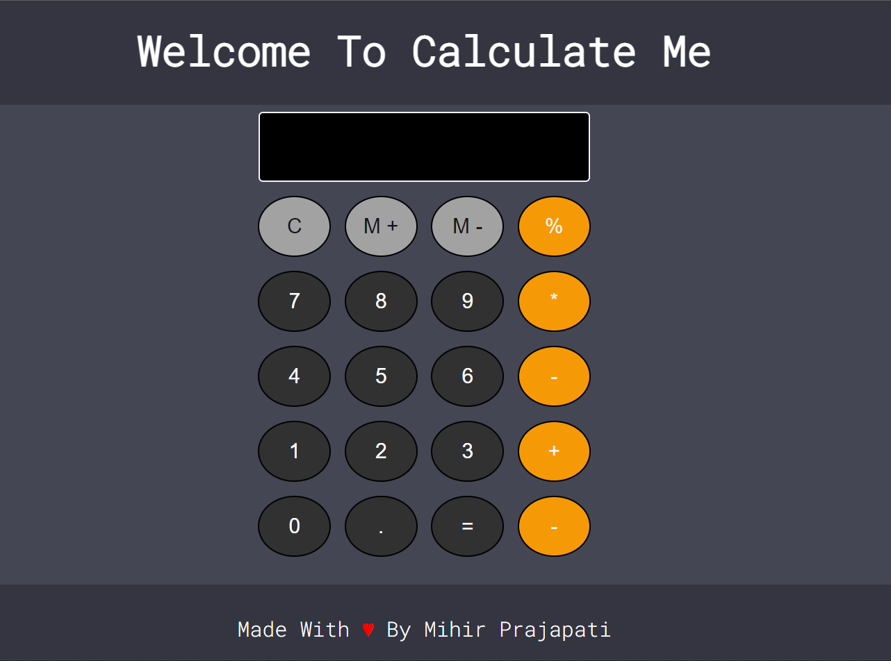

# Welcome To Calculate Me

- This is simple basic calculator made using **HTML, CSS, And Java Script**.

- Thre Are Total **4 Files** In This Project:
1. [index.html](index.html) -- Main File
2. [utils.css](utils.css) -- File For Utilities
3. [style.css](style.css) -- File For Styling
4. [script.js](script.js) -- Java Script File

## Here is the image of output of this project.

## You All Are Most Welcome To Modify This Project.

### Thank You
**lucifer510**
